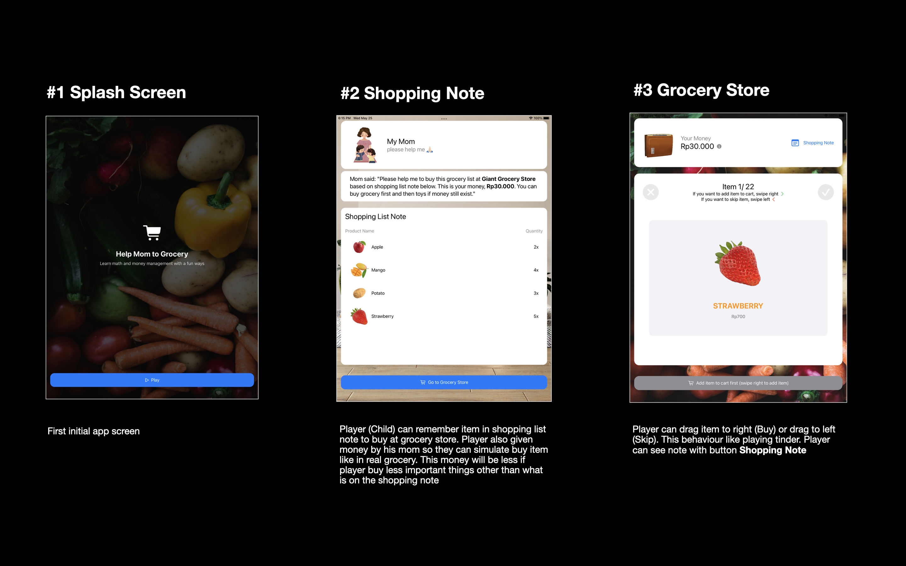
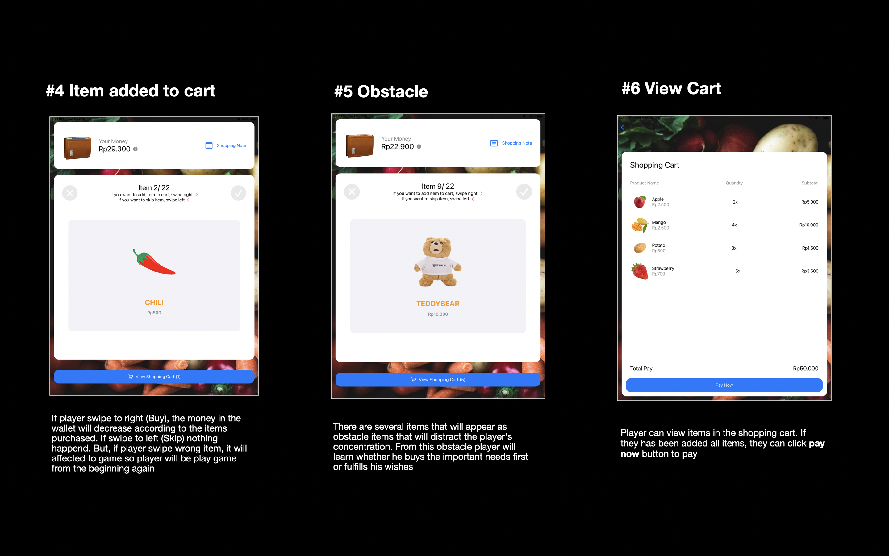
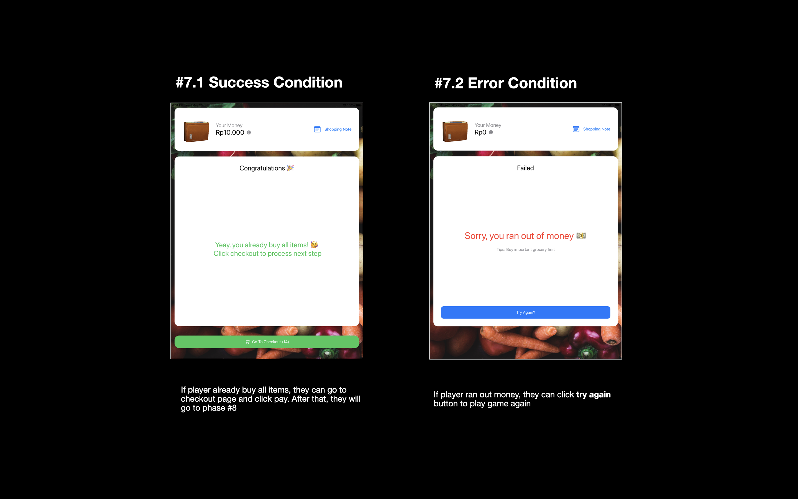
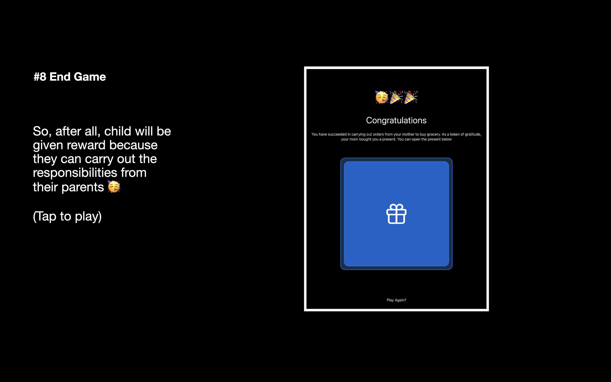

# WWDC22 Swift Student Challenge Submission
### A Swift Student Challenge Winner 2022 🎉

An educational iPad app teaching kids about budgeting and how to recognize their wants and needs in a fun and interactive way. Created as a submission to the 2022 Apple Swift Student Challenge by Miftahul Huda in April 2022.

|  |  |
--- | ---
|  |  |
--- | ---

Help Mom to Grocery is a game for child with age 8-10 years old to help their mom buy some basic needs. They will choose product based shopping notes and their budget from their mom. It inspired from serial at Netflix named "Old Enough!"

Child will learn basic math, how to manage finance, and prioritize things to buy what important first. They'll even get fun virtual prizes for every successful mission. Through this game, I hope the kids can nurture their self-directed-learning mindset.

### Installation
Will be available soon on App Store

### Demo video 
Will be available soon on Youtube

### What's next?
As of right now, the app contains 2 beginner level and some grocery items to buy. I am planning to add more level and items then publish the app on the app store to help parents teach their childern about money management.

---
All further development will take place in this [repository](https://github.com/iniakunhuda/HelpMomToGrocery-WWDC22).
